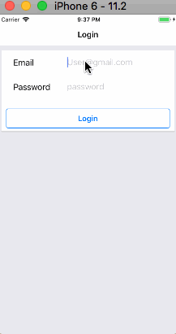

# managerApp

A mobile development project that used react native to develop the manager app. Redux and firebase was used in the project as well. The app includes a normal cycle of a mobile app, which include login and sign up (using firebase), a list to display all the employee of the user, a screen to allow create and edit employee.

